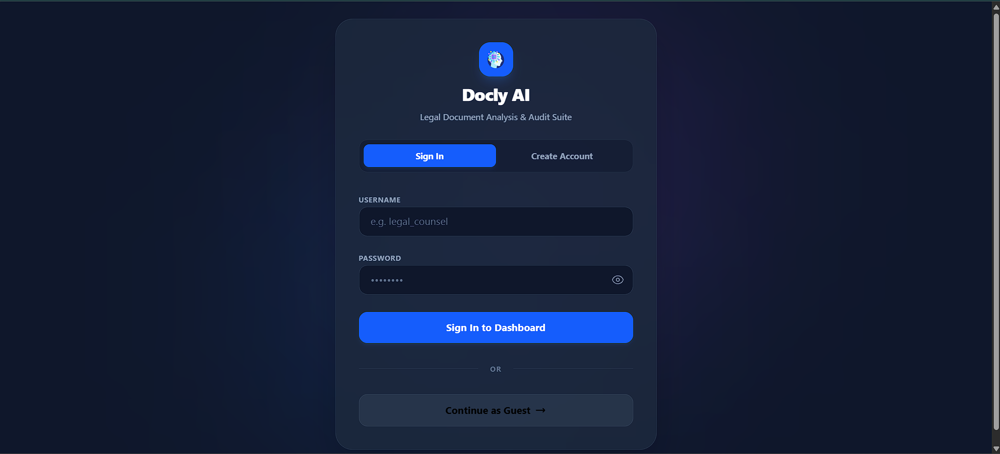
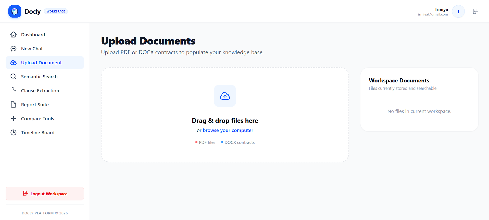
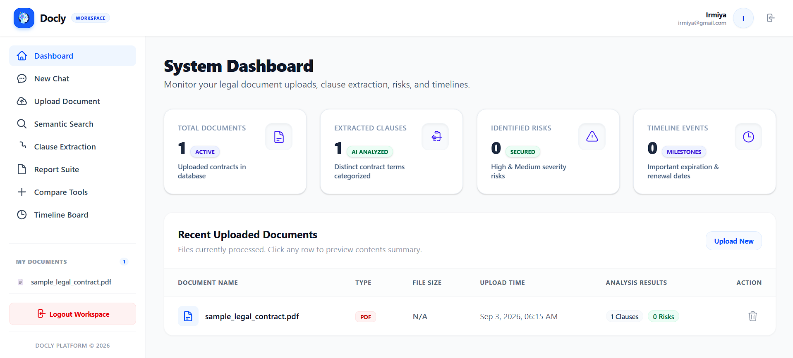
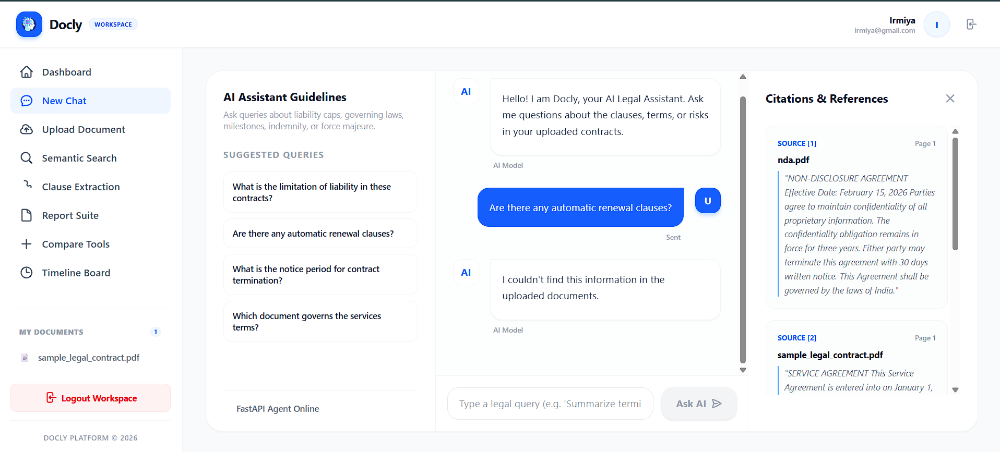
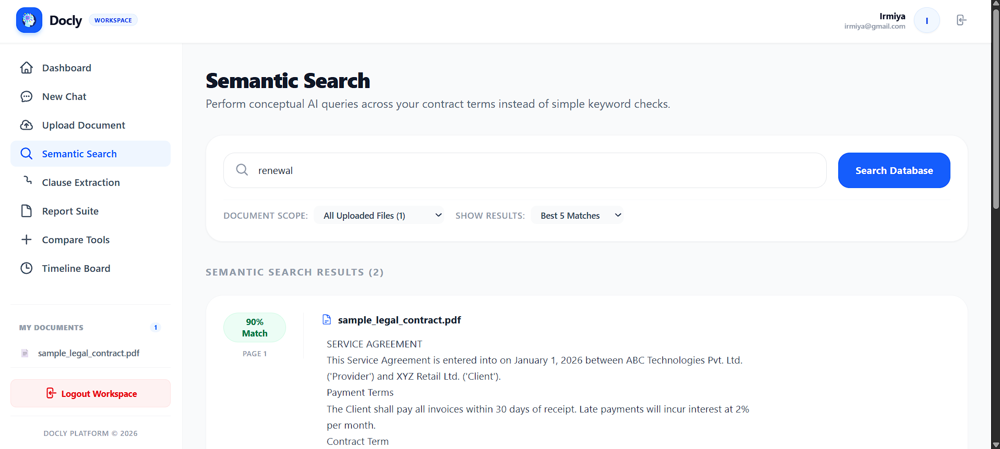
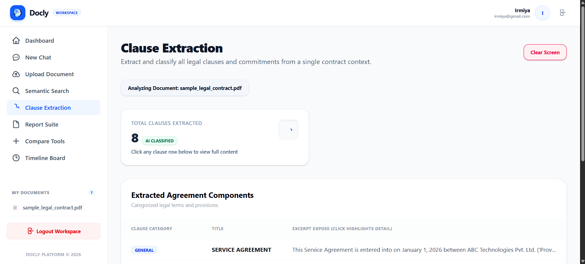
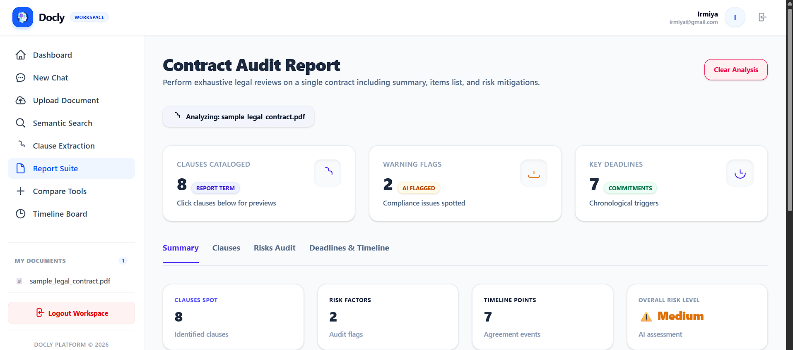
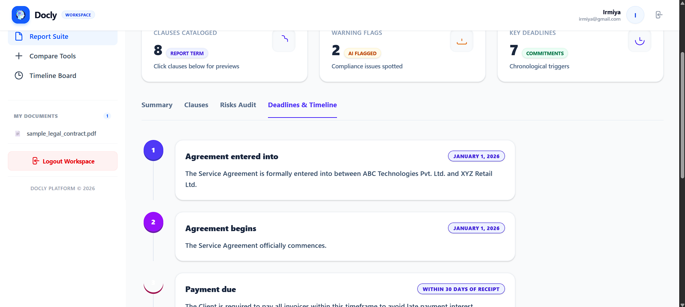
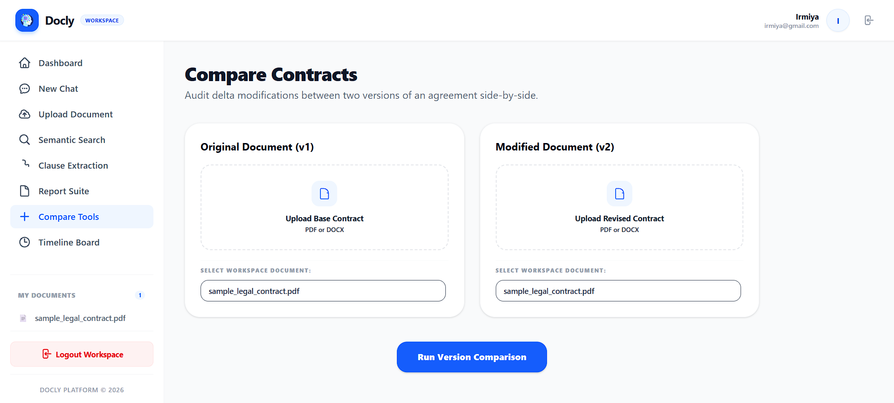

<div align="center">



# 📄 Docly AI

### AI-Powered Legal Document Analysis & Audit Suite

Upload contracts. Ask questions. Get instant clause extraction, risk flags, and deadline timelines — powered by Google Gemini.

[](https://docly-ai-six.vercel.app)


[Live Demo](https://docly-ai-six.vercel.app) · [Features](#-features) · [Getting Started](#-getting-started) · [Tech Stack](#-tech-stack)

</div>

---

## 🧠 About

**Docly AI** is a full-stack legal-tech application that turns dense contracts into structured, searchable, and auditable insight. Upload a PDF or DOCX agreement and Docly automatically chunks it into a searchable knowledge base, then lets you chat with it, extract and classify its clauses, flag risks, build a full audit report, compare two contract versions side-by-side, and pull out every date-driven obligation onto a timeline.

Built for legal counsel, compliance teams, and anyone who doesn't want to read a 40-page service agreement line by line.

---

## ✨ Features

### 🔐 Authentication & Workspace
Sign in, create an account, or jump straight in with **Continue as Guest**. Each user gets an isolated workspace for their uploaded documents.


### 📤 Document Upload & Knowledge Base
Drag-and-drop or browse to upload **PDF / DOCX** contracts. Files are automatically parsed and **chunked** into a vector-searchable knowledge base tied to your workspace.



### 📊 System Dashboard
A single view of everything Docly knows about your contracts — total documents, clauses extracted, risks identified, and upcoming timeline events, plus a table of recently uploaded files with quick access to their analysis.



### 💬 AI Legal Assistant (RAG Chat)
Ask natural-language questions about liability caps, governing law, renewal clauses, notice periods, and more. Docly answers using **retrieval-augmented generation** over your uploaded documents and returns a **Citations & References** panel showing the exact source passage and page number — so every answer is traceable back to the contract text.



### 🔍 Semantic Search
Go beyond keyword matching. Search *concepts* (e.g. "indemnification for intellectual property infringement") across one or all uploaded documents and get ranked results with a **match confidence score**.



### 🏷️ Clause Extraction
Automatically extracts and classifies every clause in a contract into categories — **General, Financial, Confidentiality, Termination, Service Obligations, Liability, Legal** — with a click-to-preview panel for the full clause text.



### 🧾 Contract Audit Report (Report Suite)
Run an exhaustive, one-click legal review of a single contract. Generates a tabbed report with:
- **Summary** — clauses spotted, risk factors, timeline points, and an AI-assessed overall risk level (Low / Medium / High)
- **Clauses** — full classified clause table
- **Risks Audit** — flagged compliance and risk issues
- **Deadlines & Timeline** — chronological milestones extracted from the agreement



### ⏱️ Timeline Board
Extracts every date-driven obligation — renewal dates, delivery deadlines, payment windows, expiry dates — and lays them out on a chronological timeline.



### 🔄 Compare Tools
Upload (or select from your workspace) two versions of the same agreement and run a **version comparison** to audit exactly what changed between v1 and v2.



---

## 🛠️ Tech Stack

| Layer | Technology |
|---|---|
| **Frontend** | React |
| **Backend** | Python (FastAPI) |
| **AI / LLM** | Google Gemini |
| **Deployment** | Vercel (frontend) |

---

## 🚀 Getting Started

### Prerequisites
- Node.js (v18+) and npm/yarn
- Python 3.10+
- A Google Gemini API key

### 1. Clone the repository
```bash
git clone https://github.com/Irmiya07/Docly-AI.git
cd Docly-AI
```

### 2. Backend setup (FastAPI)
```bash
cd backend
python -m venv venv
source venv/bin/activate   # On Windows: venv\Scripts\activate
pip install -r requirements.txt
```

Create a `.env` file in the `backend` folder:
```env
GEMINI_API_KEY=your_google_gemini_api_key
```

Run the API server:
```bash
uvicorn main:app --reload
```

### 3. Frontend setup (React)
```bash
cd ../frontend
npm install
```

Create a `.env` file in the `frontend` folder pointing to your backend:
```env
VITE_API_BASE_URL=http://localhost:8000
```

Run the dev server:
```bash
npm run dev
```

The app will be available at `http://localhost:5173`.

> ⚠️ Adjust the exact commands, env variable names, and file paths above to match what's actually inside `backend/` and `frontend/` in this repo — replace with your real `requirements.txt` / `package.json` scripts if they differ.

---

## 📁 Project Structure

```
Docly-AI/
├── backend/          # FastAPI server, document processing & Gemini integration
├── frontend/         # React application (UI, chat, dashboard, reports)
├── .vscode/          # Editor configuration
└── README.md
```

---

## 🗺️ Roadmap Ideas

- [ ] Multi-document batch auditing
- [ ] Export audit reports as PDF/DOCX
- [ ] Role-based access for legal teams
- [ ] Support for additional file formats (e.g. scanned/OCR PDFs)

---

## 🤝 Contributing

Contributions, issues, and feature requests are welcome. Feel free to open a PR or issue.

## 📄 License

This project is licensed under the MIT License.

---

<div align="center">

Built by [Irmiya07](https://github.com/Irmiya07)

</div>
